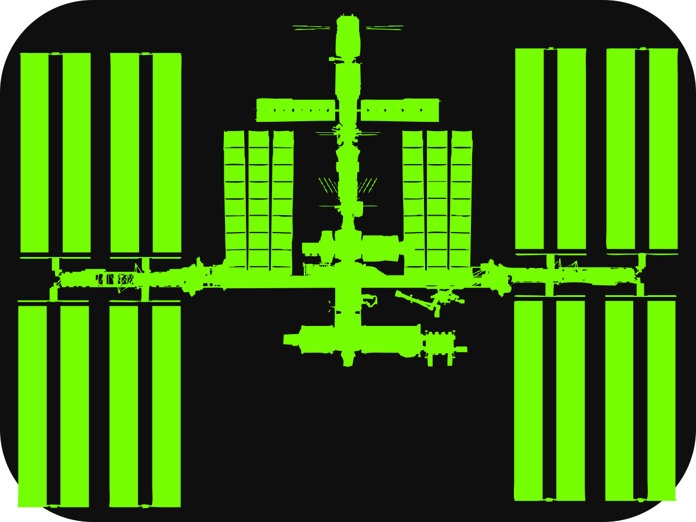
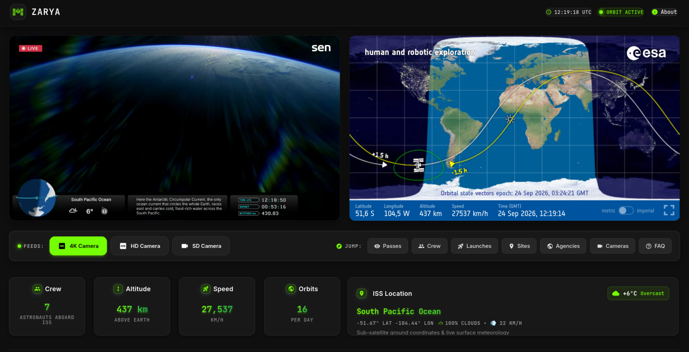
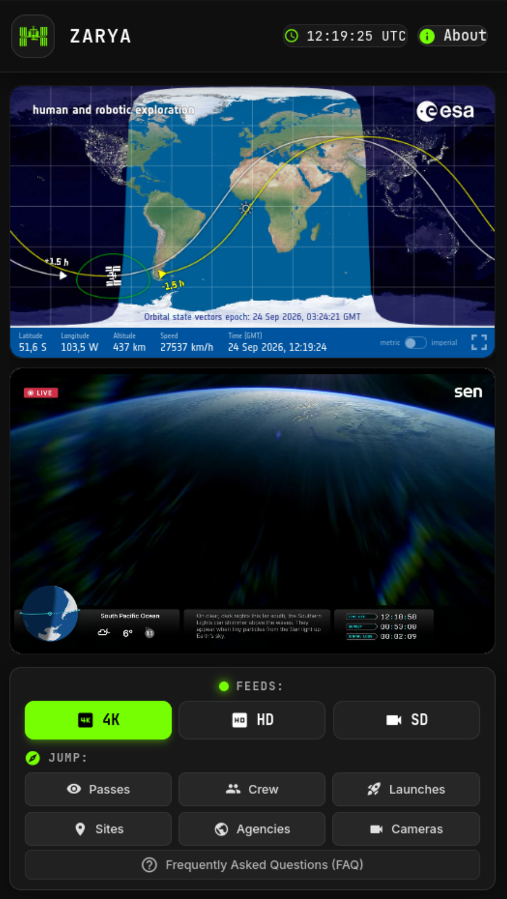

<div align="center">



<h1>ZARYA</h1>

<p><strong>Real-time ISS Telemetry Console &amp; Live Video Dashboard</strong></p>

<p>
  
  
  
  
  
  
</p>

<p>
  <a href="https://barizshah.github.io/zarya"><strong>🚀 Live Demo</strong></a>
  &nbsp;·&nbsp;
  <a href="https://github.com/barizshah/zarya/issues">Report Bug</a>
  &nbsp;·&nbsp;
  <a href="https://github.com/barizshah/zarya/issues">Request Feature</a>
</p>

</div>

---

## ✨ What is Zarya?

**Zarya** is named after the very first module of the International Space Station — launched in 1998, *Zarya* means **"Dawn"** in Russian. This app is a fast, lightweight, real-time telemetry console and live video dashboard that tracks humanity's orbital outpost as it circles Earth at **27,580 km/h**.

No app install. No sign-up. Just open it and watch the ISS fly over you in real time.

---

## 🛰️ Features

| Feature | Details |
|---|---|
| 📡 **Live Telemetry** | Altitude, velocity, lat/lon, visibility, and overhead region — refreshed every 4 seconds |
| 🌦️ **ISS Surface Weather** | Live surface weather (temperature, cloud cover %, conditions) directly beneath the ISS via Open-Meteo |
| 🗺️ **ESA Orbital Tracker** | Live precision ground track with day/night terminator via European Space Agency's ISS tracker |
| 📺 **Multi-feed Live Video** | Switch seamlessly between Sen 4K Ultra HD, NASA HD, and NASA SD mission audio feeds |
| 🌍 **3-Point Pass Predictions** | Precision flyover times with 3-point trajectory (start, culmination peak, departure), visual magnitude (`-3.5 mag Brilliant`), and daylight vs twilight filtering |
| 🧑‍🚀 **Crew Manifest** | Expedition 73 astronaut cards with portraits, agencies, roles, bios, and days-in-space counters |
| 🚀 **Launch Schedule** | Upcoming orbital rocket launches from Launch Library 2 with automatic fallback |
| 🏢 **Launch Sites** | Major spaceports and orbital launch complexes worldwide |
| 🏛️ **Space Agencies** | NASA, ESA, Roscosmos, JAXA, CSA, ISRO, and more |
| ❓ **FAQ & Overpass Facts** | In-depth answers about the ISS and dynamic educational facts contextualized to current ground track |

---

## 📸 Screenshots

> *App running live at [barizshah.github.io/zarya](https://barizshah.github.io/zarya)*

### Desktop — Telemetry Dashboard


### Mobile — Live Feeds & Tracker


---

## 🧱 Tech Stack

| Layer | Technology |
|---|---|
| Framework | [React 19](https://react.dev) + [TypeScript 6](https://typescriptlang.org) |
| Build Tool | [Vite 8](https://vite.dev) |
| Styling | [Tailwind CSS 4](https://tailwindcss.com) + custom CSS |
| Icons | [Lucide React](https://lucide.dev) + Material Icons |
| Map | [ESA ISS Tracker](https://isstracker.spaceflight.esa.int/) (embedded iframe) |
| Telemetry | [WhereTheISS.at](https://wheretheiss.at) REST API |
| Crew Data | [Open Notify](http://open-notify.org) / enriched local fallback |
| Launches | [Launch Library 2](https://thespacedevs.com/llapi) API |
| Geocoding | [OpenStreetMap Nominatim](https://nominatim.openstreetmap.org) |
| Deploy | GitHub Pages via GitHub Actions |

---

## 🚀 Getting Started

### Prerequisites
- [Node.js](https://nodejs.org) ≥ 22
- [npm](https://npmjs.com) ≥ 10

### Installation

```bash
# 1. Clone the repository
git clone https://github.com/barizshah/zarya.git
cd zarya

# 2. Install dependencies
npm install

# 3. Start development server
npm run dev
```

Open [http://localhost:5173/zarya/](http://localhost:5173/zarya/) in your browser.

### Available Scripts

| Command | Description |
|---|---|
| `npm run dev` | Start dev server with hot reload |
| `npm run build` | Production build to `dist/` |
| `npm run preview` | Preview production build locally |
| `npm run lint` | Run Oxlint static analysis |

---

## 📦 Deployment

This project deploys automatically to **GitHub Pages** on every push to `main` via GitHub Actions.

**Manual build:**
```bash
npm run build
# Output is in dist/ — deploy to any static host
```

**Live URL:** [https://barizshah.github.io/zarya](https://barizshah.github.io/zarya)

---

## 📡 Data Sources

| Source | Used For |
|---|---|
| [WhereTheISS.at](https://wheretheiss.at) | Primary live ISS position and velocity telemetry |
| [ESA ISS Tracker](https://isstracker.spaceflight.esa.int/) | Precision ground track map & orbit trajectory |
| [Open-Meteo](https://open-meteo.com) | Sub-satellite real-time surface meteorology & cloud cover |
| [Pollux Labs / SGP4](https://polluxlabs.net) | SGP4 orbital mechanics pass flyover calculations |
| [Sen.com via YouTube](https://www.youtube.com/@Sen) | 4K Ultra HD live camera feed |
| [NASA YouTube](https://www.youtube.com/@NASA) | HD & SD camera + mission audio feeds |
| [Launch Library 2](https://thespacedevs.com/llapi) | Upcoming orbital rocket launch schedule |
| [OpenStreetMap Nominatim](https://nominatim.openstreetmap.org) | Reverse geocoding for ISS overhead location |

All data is fetched in real-time client-side — no backend server required.

---

## 🤝 Contributing

Contributions are welcome! Please read [CONTRIBUTING.md](CONTRIBUTING.md) first.

1. Fork the repository
2. Create a feature branch (`git checkout -b feat/amazing-feature`)
3. Commit your changes (`git commit -m 'feat: add amazing feature'`)
4. Push to the branch (`git push origin feat/amazing-feature`)
5. Open a Pull Request

---

## 📋 Changelog

See [CHANGELOG.md](CHANGELOG.md) for a full history of changes.

---

## 📄 License

MIT License — see [LICENSE](LICENSE) for details.

---

<div align="center">

Built by <a href="https://github.com/barizshah">@barizshah</a> · Powered by open data from NASA, ESA, and the space community

<sub>⭐ Star this repo if you find it useful!</sub>

</div>
